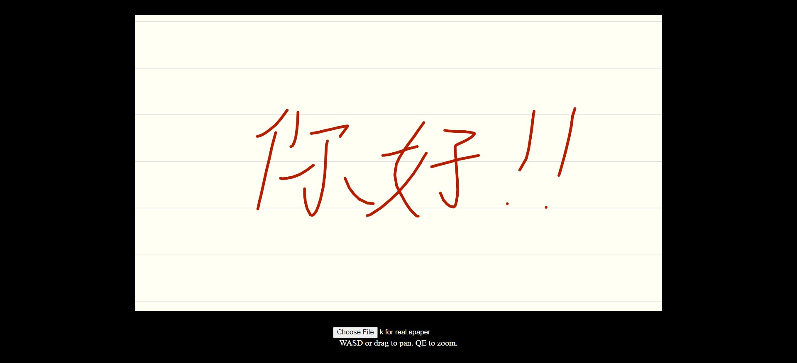

# a Viewer

A web-based viewer for notes made in the [a Paper](https://play.google.com/store/apps/details?id=jp.gr.java_conf.pepperretas.apaper&hl=en) Android app. While the app is cool and makes taking temporary or less important notes easy, it also has a tendency to become unstable as the number and size of notes grows to the point where the app can't be opened anymore... which explains this web-based viewer.

[Live demo can be found here.](https://lenzrivera.github.io/a-viewer) Sample files are located in the `sample` directory.

## TODO

- Batch render Strokes with the same color and width
- Simple QOL fixes
  - Error messages, particulary for invalid files
  - Drag to pan, scroll or pinch to zoom
  - Proper timestep in input/navigation loop
  - Responsive canvas; take all available screen space
- History view; show a list of all the actions committed to the file, and each state of the file can be viewed through that list 
- Music ruler support
- Line smoothing (especially Inkstroke envelope smoothing)
- WebGL rendering